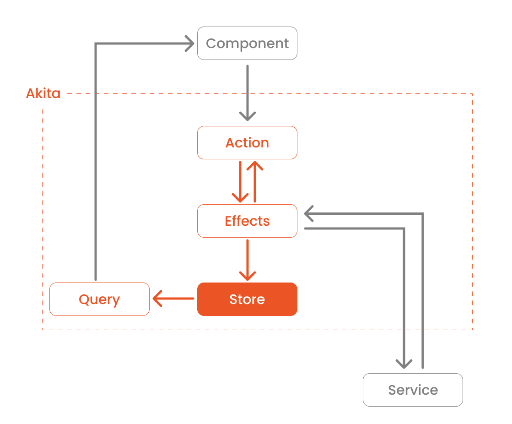
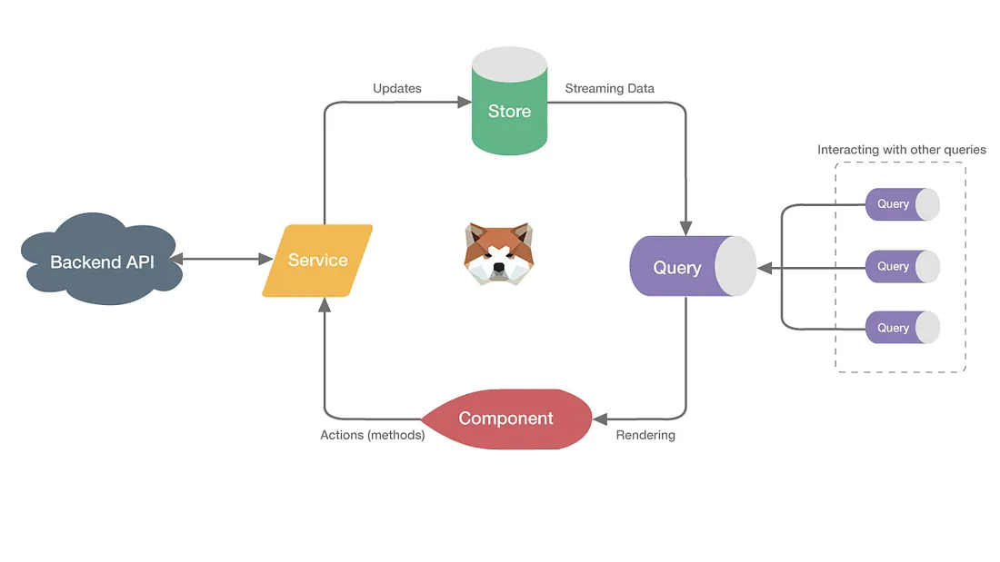

# Angular Akita

- **Akita** is a state management pattern, built on top of RxJS, which takes the idea of multiple data stores from Flux
  and the immutable updates from Redux, along with the concept of streaming data, to create the Observable Data Store
  model.


- **Akita** encourages simplicity. It saves you the hassle of creating boilerplate code and offers powerful tools with a
  moderate learning curve, suitable for both experienced and inexperienced developers alike.


- **Akita** is based on object-oriented design principles instead of functional programming, so developers with OOP
  experience should feel right at home. Its opinionated structure provides your team with a fixed pattern that cannot be
  deviated from.

## Installation

```
npm i @datorama/akita --save
```

### Devtools (optional)

```
npm i @datorama/akita-ngdevtools --save
```

## Structure

Akita is made up of 4 main components:

* Store;
* Actions;
* Query (like `selectors` in NgRx);
* Effects.

## Workflow / Architecture





## High-level principles

1. The Store is a single object which contains the store state and serves as the “single source of truth.”
2. The only way to change the state is by calling `setState()` or one of the update methods based on it.
3. A component should NOT get the data from the store directly but instead, use a Query.
4. Asynchronous logic and update calls should be encapsulated in services and data services.

## References

1. [State Management in Angular Using Akita](https://auth0.com/blog/state-management-in-angular-with-akita-1/) - part 1.
2. [State Management in Angular Using Akita](https://auth0.com/blog/state-management-in-angular-with-akita-2/) - part 2.
3. [Akita Best Practices](https://opensource.salesforce.com/akita/docs/best-practices).
4. [Using Akita with Effects & Actions](https://medium.com/fafnur/redux-в-angular-использование-akita-81456b166675).
